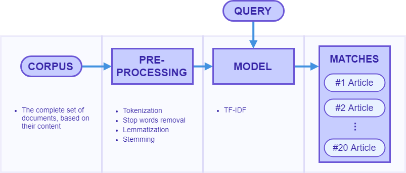

# Document Search Engine
> Simple search engine architecture applied on the [All the news dataset](https://www.kaggle.com/snapcrack/all-the-news/version/4#articles1.csv).

This search engine was developed in the context of the challenge presented in Talkdesk during the application for an NLP Data Scientist.
The opted apporach aggregates a simple Document Ranking pipeline which resorts to tf-idf distributions of the dataset in order to match queries with the words present in the dataset.
The Architecture sections presents the adopted approach in detail, whereas the external libraries used in the arch components are shown next. The adopted model is also briefly detailed, and, finally, a small description of the built tests is provided.

## Architecture

The presented challenge focuses on the search of the most meaningful articles based on a user-given query. This type of problem is commonly reffered to as Document Ranking. In order to solve this particular case, the following approach, shown in the figure below, was taken.



The corpus contains the entire dataset, which is pre-processed, following the shown steps:
1. Each article's content is tokenized (using NLTK's word_tokenize) without accounting for most punctuation, as we don't want to split contractions or hyphenized words.
2. The tokens are filtered through stop words. Tokens short of 3 characters are also discarded.
3. Each token is lemmatized (using WordNetLemmatizer) and stemmed (using the english SnowballStemmer). These 2 operations are crucial in order to uniformize the tokens gathered for each document, and, in particular, to attain general terms to provide better query matches.

Once the tokens have been properly processed, the model (a TF-IDF matrix, provided by Scikit-Learn's TfidfVectorizer) is fitted. Do note that this implementation also allows to further reduce the number of tokens, in order to beneffit the produced metrics:
1. Tokens that appear in less than 8% of the corpus are removed
2. Tokens that appear in more than 50% of the corpus are removed

Through this step, we are able to reduce ambiguity, due to the least frequent tokens contributing less to the model, and the most frequent diluting the document-specific terms. Additionally, this step greatly reduces the produced models size.

Once the model has been fitted, a user provided query can serve as input. The query is pre-processed and matched with all of the documents present in the model.

The ranking score is given by the following pseudo-code:

```
for document in tfidf:
    for word in document:
        if word appears in query:
            rank[document] += tfidf[document, word]
```

## External libraries
[Pandas](https://pandas.pydata.org/) - Used to process the dataset and data structures throughout the implementation.

[NLTK](https://www.nltk.org/) - Used for the pre-processing steps.

[Scikit-Learn](https://scikit-learn.org/stable/) - Used for the TF-IDF model.

## Tests
